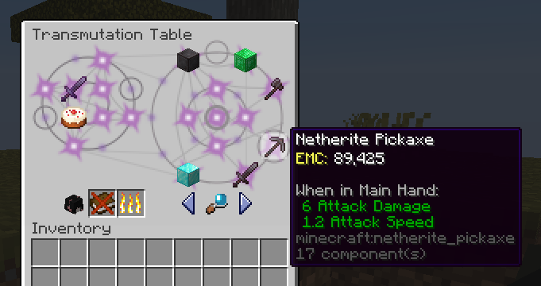
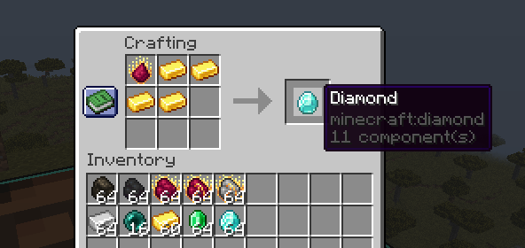

# 我在 91% 的 Gemini 中混進了一些史
 - ### 開發中，請主人把 BUG Report 狠狠地塞進我的 Issue 里 🥵

## 電子寵物

## 戰績展示
### 轉化桌

### 賢者之石

## 許願池
 - 賢者之石 的 方塊嬗變 
 - 賢者之石 的 實體嬗變 
 - 賢者之石 的 物品嬗變（一半）
 - 共價粉
 - 煉金術箱子
 - 能量凝聚器
 - 能量收集器
 - 反物質繼電器

## 前人種樹的人的樹
 - [sinkillerj/ProjectE](https://github.com/sinkillerj/ProjectE)
 - [ItemsAdder](https://itemsadder.com/)
 - [Bbublick/projecte-retexture](https://www.curseforge.com/minecraft/texture-packs/projecte-retexture)
 - [professor-lee/StoneBadge](https://github.com/professor-lee/StoneBadge)
